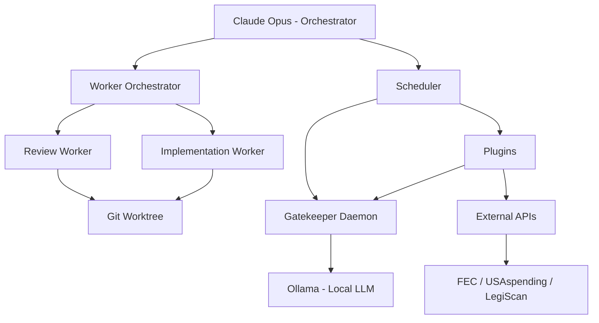

# Dual Documentation Architecture

## The Problem: One Audience Has Been Invisible

Every piece of documentation ever written has assumed a human reader. READMEs explain concepts. Tutorials walk through steps. API docs describe endpoints in prose. Even "machine-readable" formats like OpenAPI are ultimately designed for human developers who will write code against them.

But now there is a second audience: autonomous AI agents.

Claude Code reads your CLAUDE.md. Cursor reads your .cursorrules. MCP servers expose tool manifests. AI agents are parsing your repository structure, reading your code, inferring your intentions, and making decisions about what to do next. They are doing this with documentation that was never written for them.

This is the gap. Not a theoretical one -- a practical one that every project using AI agents encounters daily. The agent misunderstands the project structure. It makes a decision that violates an unwritten convention. It cannot find the success criteria for a task because they exist only in a human's head, described only in narrative prose that requires inference to parse.

Cleansing Fire is designed as an agent-first project. AI agents are not afterthoughts or tools -- they are collaborators and autonomous workers. The documentation must reflect this.

## Why Dual Documentation

### What Humans Need

Humans are narrative creatures. We understand through stories, examples, metaphor, and context. Good human documentation:

- **Explains why** before what. Motivation precedes instruction.
- **Provides context.** Where does this fit in the larger picture? What problem does it solve?
- **Uses examples.** Show me, don't just tell me.
- **Builds incrementally.** Start simple, add complexity.
- **Acknowledges ambiguity.** "It depends" is a valid answer when accompanied by the factors it depends on.
- **Inspires.** Especially for a project like Cleansing Fire, where the philosophical grounding matters as much as the technical implementation.

Cleansing Fire's existing `philosophy.md` and `docs/` research files are exemplary human documentation -- they give readers the full context of what this project is and why it matters.

### What AI Agents Need

AI agents operate differently. When an autonomous Claude Code worker is launched in a git worktree to implement a feature, it needs:

- **Structured data.** Not paragraphs -- schemas, enumerations, decision trees.
- **Explicit success criteria.** What does "done" look like? Not "make it good" but "output must validate against this JSON Schema."
- **Dependency graphs.** What must exist before this can work? What breaks if this changes?
- **Clear interfaces.** Exact input formats, output formats, error codes, timeout values.
- **Boundaries.** What is this agent allowed to do? What is forbidden? What requires human approval?
- **Priority ordering.** When two goals conflict, which wins?
- **State machines.** What states can a process be in? What transitions are valid?

An agent can read prose and extract meaning from it. But prose is lossy for machines -- it requires inference, it contains ambiguity, and different models will interpret the same paragraph differently. Structured specs eliminate that variance.

### The Current State of the Art

Almost no one has solved this well. Here is what exists:

**CLAUDE.md (Anthropic/Claude Code)**
The `CLAUDE.md` convention is the closest thing to AI-first project documentation. It is a markdown file in the project root that Claude Code reads at the start of every session. It stores conventions, decisions, architecture notes, and commands -- essentially a system prompt for the project. It is loaded into every conversation, giving Claude persistent memory across sessions. The `/init` command can generate a starter CLAUDE.md from project structure analysis. However, CLAUDE.md is still fundamentally prose. It is structured markdown, but not machine-parseable in the strict sense. It works because Claude is good at understanding natural language, not because it provides formal specifications. Sources: [Using CLAUDE.MD files](https://claude.com/blog/using-claude-md-files), [How to Write a Good CLAUDE.md](https://www.builder.io/blog/claude-md-guide).

**Cursor Rules (.cursor/rules/)**
Cursor AI uses `.mdc` files in `.cursor/rules/` to provide project-specific instructions. These evolved from a single `.cursorrules` file to a directory of focused, scoped rule files. Each rule is actionable and focused, written like clear internal documentation. Like CLAUDE.md, these are natural language instructions -- not formal specs. Sources: [Cursor Rules Docs](https://cursor.com/docs/context/rules).

**Agents.md (Emerging Standard)**
An emerging 2025 open standard for AI coding agents. It defines machine-readable manifests declaring agent capabilities, an interchange schema for file formats, and a standardized runtime API for lifecycle and telemetry. This is the closest to what we need -- explicit machine-readable capability declarations rather than prose descriptions. Source: [What Is Agents.md?](https://www.remio.ai/post/what-is-agents-md-a-complete-guide-to-the-new-ai-coding-agent-standard-in-2025).

**MCP Tool Manifests (Model Context Protocol)**
The Model Context Protocol, originally from Anthropic and now under the Linux Foundation's Agentic AI Foundation, defines tool manifests -- machine-readable registries that describe available tools, their parameters, invocation patterns, and constraints. MCP is now the universal standard for connecting AI agents to external tools, with 97M+ monthly SDK downloads and support from Anthropic, OpenAI, Google, and Microsoft. The tool manifest format (JSON-based) is a direct precedent for capability-based AI documentation. Sources: [MCP Specification](https://modelcontextprotocol.io/specification/2025-11-25), [Why MCP Won](https://thenewstack.io/why-the-model-context-protocol-won/).

**Agent2Agent Protocol (A2A)**
Google's Agent2Agent protocol, now also under the Linux Foundation, defines how agents communicate with each other and share standardized capability information. Uses HTTP, SSE, and JSON-RPC. Complements MCP (which connects agents to tools) by connecting agents to each other. Over 50 technology partners. Sources: [A2A Protocol](https://developers.googleblog.com/en/a2a-a-new-era-of-agent-interoperability/), [IBM: What is A2A?](https://www.ibm.com/think/topics/agent2agent-protocol).

**Policy Cards**
A machine-readable standard for expressing operational, regulatory, and ethical constraints for AI agents. Policy Cards encode allow/deny rules, obligations, and evidentiary requirements. They can be validated automatically, version-controlled, and linked to runtime enforcement. Directly relevant to our need for agent safety boundaries. Source: [Policy Cards](https://arxiv.org/abs/2510.24383).

**OpenAPI / AsyncAPI**
OpenAPI (for REST APIs) and AsyncAPI (for event-driven APIs) are mature specifications for machine-readable API documentation. They prove that formal, structured API documentation is not just possible but transformative -- enabling code generation, validation, testing, and documentation from a single source of truth. Sources: [AsyncAPI](https://www.asyncapi.com/), [JSON Schema](https://json-schema.org/).

**JSON-LD / Schema.org**
The semantic web's approach to structured knowledge representation. JSON-LD adds a `@context` to JSON that links data to well-defined vocabularies. Schema.org provides the vocabulary. Together they create machine-readable, semantically rich data that AI systems use for knowledge graphs. This is the deepest precedent for the idea that the same information should exist in both human-readable and machine-readable forms. Sources: [JSON-LD](https://json-ld.org/), [Schema.org Developers](https://schema.org/docs/developers.html).

### The Gap

None of these fully solve the dual documentation problem because:

1. **CLAUDE.md and Cursor rules** are prose-for-AI, not structured specs.
2. **MCP and A2A** are protocol-level, not project-level.
3. **OpenAPI and AsyncAPI** cover APIs, not project goals, decision trees, or agent behavior.
4. **Policy Cards** cover constraints, not capabilities or workflows.
5. **JSON-LD** provides semantic structure, but no convention for project documentation.

What is missing is a **project-level, structured, machine-readable documentation convention** that sits alongside human documentation and covers the full scope of what an AI agent needs to work autonomously on a project.

That is what we are building.

## The Architecture

### Layer 1: Human Documentation (docs/)

The `docs/` directory contains documentation written for human readers. In Cleansing Fire, this includes:

```
docs/
  index.html                   # GitHub Pages landing page
  technology-research.md       # Technical landscape research
  decentralized-systems.md     # Decentralized architecture research
  economics.md                 # Economic models and analysis
  historical-research.md       # Historical precedents and case studies
  literary-arsenal.md          # Persuasion, rhetoric, narrative techniques
  multimedia-tools.md          # Audio, video, visual communication tools
  dual-documentation.md        # This document
```

Human docs characteristics:
- Narrative structure with context and motivation
- Rich prose explaining not just what but why
- Examples, case studies, historical parallels
- Philosophical grounding (critical for Cleansing Fire)
- Tutorials and guides for contributors
- Visual and multimedia elements where appropriate
- Emotional resonance -- this is a project about power and justice; the docs should reflect that

### Layer 2: AI Specifications (specs/)

The `specs/` directory contains structured, machine-parseable documentation for AI agents. This is the novel contribution.

```
specs/
  README.md                    # How AI agents should use this directory
  project-graph.yaml           # Component dependency graph
  plugin-schema.json           # JSON Schema for plugin interface
  agent-capabilities.yaml      # What agents can do, and their boundaries
  goals.yaml                   # Goal hierarchy with success criteria
```

Future specs as the project grows:
```
specs/
  workflows/
    implementation.yaml        # State machine for implementation workflow
    review.yaml                # State machine for review workflow
    investigation.yaml         # State machine for civic investigation
  schemas/
    gatekeeper-api.yaml        # OpenAPI spec for gatekeeper HTTP API
    scheduler-tasks.json       # JSON Schema for tasks.json format
    plugin-io/
      civic-legiscan.json      # Input/output schema for each plugin
      civic-fec.json
      civic-spending.json
      civic-crossref.json
      forge-vision.json
      forge-voice.json
      pipeline-data-to-fire.json
  decisions/
    architecture-decisions.yaml # ADRs in structured format
    technology-choices.yaml     # Why we chose X over Y, machine-readable
  federation/
    protocol.yaml              # Federation protocol specification
    node-manifest.yaml         # What a Cleansing Fire node advertises
```

AI specs characteristics:
- Structured data formats (YAML, JSON, JSON Schema)
- Explicit types, enumerations, constraints
- Success criteria as testable assertions
- Dependency graphs as adjacency lists
- Decision trees as explicit conditional structures
- No ambiguity -- if something could be interpreted two ways, it is under-specified

### Layer 3: The Bridge

The bridge layer connects human and AI documentation, keeping them in sync and enabling cross-referencing.

**CLAUDE.md as the Bridge File**

The existing `CLAUDE.md` already serves a bridging function -- it is prose (human-readable) that is loaded as agent context (AI-consumed). We extend this by adding explicit links:

```markdown
## Documentation
- Human docs: docs/
- AI specs: specs/
- For project goals, see: specs/goals.yaml (structured) or philosophy.md (narrative)
- For plugin interface, see: specs/plugin-schema.json (schema) or plugins/README (prose)
```

**Cross-References**

Every spec file includes a `human_docs` field linking to the narrative equivalent:

```yaml
# In specs/goals.yaml
metadata:
  human_docs:
    - path: philosophy.md
      description: "Full philosophical framework and motivation"
    - path: docs/economics.md
      description: "Economic models and analysis"
```

Every human doc can reference its machine-readable counterpart:

```markdown
<!-- In docs/technology-research.md -->
> Machine-readable spec: [specs/project-graph.yaml](../specs/project-graph.yaml)
```

**Sync Strategy**

Keeping dual docs in sync is the hardest problem. Our approach:

1. **Specs are the source of truth for interfaces.** If the plugin schema changes, `specs/plugin-schema.json` is updated first. Human docs follow.
2. **Human docs are the source of truth for motivation.** If the project goals change, `philosophy.md` and `docs/` are updated first. Specs follow.
3. **CLAUDE.md references both.** It should always point agents to the right source depending on what they need.
4. **Automated validation.** Scripts can check that specs are valid (JSON Schema validation, YAML lint) and that cross-references are not broken.
5. **Agent-assisted sync.** AI agents themselves can be tasked with updating one layer when the other changes -- an event task in the scheduler can detect spec changes and flag human docs for review, or vice versa.

## Format Decisions

### YAML for Configuration and Specifications

YAML is the primary format for AI-readable specs. Rationale:

- **Human-readable enough** for developers to edit directly
- **Supports comments** (unlike JSON), essential for explaining spec decisions
- **Clean hierarchy** through indentation, natural for dependency graphs and goal trees
- **Multi-line strings** for longer descriptions without escaping
- **Industry standard** for agent configuration (CrewAI, Kubernetes, GitHub Actions, etc.)
- **Parseable by every language** and every AI model

### JSON Schema for Interface Validation

JSON Schema is used for formal interface definitions (plugin I/O, API payloads). Rationale:

- **Validation is automatic.** Given a schema, any tool can verify a payload is correct.
- **Code generation is possible.** Schemas can generate type stubs, documentation, mock data.
- **The standard is mature.** JSON Schema 2020-12 is well-supported across all languages.
- **AI models understand it.** Schema definitions are unambiguous to language models.

### OpenAPI for HTTP APIs (Future)

When the Gatekeeper API is formally documented, OpenAPI 3.1 (which uses JSON Schema 2020-12 natively) is the right choice. It enables:

- Client code generation
- Request/response validation
- Interactive documentation (Swagger UI)
- Testing scaffolding

### Mermaid for Architecture Diagrams

Mermaid syntax is used for diagrams in both human and AI docs because:

- **Text-based** -- lives in version control, diffable, no binary blobs
- **Renderable** by GitHub, most markdown viewers, and documentation sites
- **Parseable** by AI models -- they can read and generate Mermaid syntax
- **Bridges the gap** -- a single Mermaid diagram serves both human (visual) and AI (structural) readers

Example (the project architecture):



## Implementation Plan

### Phase 1: Foundation (Current)

- Create `specs/` directory with initial spec files
- Write `specs/README.md` explaining the convention
- Create `project-graph.yaml`, `plugin-schema.json`, `agent-capabilities.yaml`, `goals.yaml`
- Update `CLAUDE.md` to reference specs

### Phase 2: Plugin Schemas

- Create individual JSON Schema files for each plugin's input/output
- Add a validation script that checks plugin I/O against schemas
- Auto-generate plugin documentation from schemas

### Phase 3: Workflow State Machines

- Define the implementation workflow as a formal state machine
- Define the review workflow as a formal state machine
- Define the investigation pipeline as a state machine
- These enable agents to know exactly what state they are in and what transitions are valid

### Phase 4: API Specifications

- Write OpenAPI spec for the Gatekeeper HTTP API
- Write AsyncAPI spec for the event-driven scheduler
- Generate client stubs and validation middleware from specs

### Phase 5: Federation Specs

- Define the federation protocol in machine-readable format
- Create node manifest specification (what a Cleansing Fire node advertises to the network)
- Define inter-node message schemas

### Phase 6: Automated Sync

- CI/CD pipeline that validates all specs on every commit
- Script that checks cross-references between human and AI docs
- Event-driven task that flags docs for update when code changes
- Agent task that proposes spec updates based on code changes

## Design Principles

1. **Specs are not bureaucracy.** They exist to reduce ambiguity for autonomous agents, not to create process overhead. If a spec does not help an agent make a better decision, it should not exist.

2. **Start concrete, abstract later.** Write specs for what exists now, not for hypothetical future systems. The plugin schema documents the actual plugin interface. The project graph documents the actual components.

3. **Agents are readers, not just executors.** Specs should contain enough context that an agent can understand *why* a decision was made, not just *what* the decision is. Use comments and description fields generously.

4. **Version everything.** Specs have version numbers. When a spec changes, the version increments. Agents can check whether they are working with the latest version.

5. **Fail loudly.** If an agent encounters a situation not covered by the specs, it should raise an error rather than guess. Under-specification is a bug.

6. **The cost heuristic applies.** Per Pyrrhic Lucidity: if writing a spec costs nothing -- if it is trivially easy and requires no thought -- it is probably not capturing anything useful. Good specs require grappling with actual complexity.
